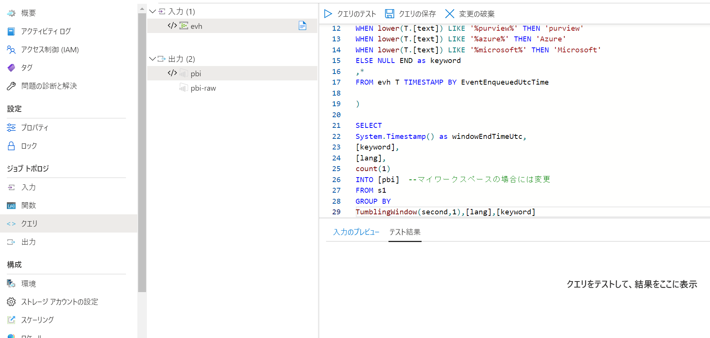

# Azure Stream Analytics でのソーシャル メディア分析 ハンズオン

このリポジトリは以下のソリューションのハンズオンラボです。
vscodeにより簡単にデプロイできます。

[Azure Stream Analytics でのソーシャル メディア分析](https://docs.microsoft.com/ja-jp/azure/stream-analytics/stream-analytics-twitter-sentiment-analysis-trends#prerequisites)

[](https://portal.azure.com/#create/Microsoft.Template/uri/https%3A%2F%2Fraw.githubusercontent.com%2Fryoma-nagata%2FAzureStreamAnalytics-TwitterDemo%2Fmaster%2Finfrastructure%2Fmain.json)


## 前提条件

- Azure サブスクリプションに対する所有者権限
- [Twitter](https://twitter.com/)アカウント
- docker
- VSCode Remote Conteinr環境
- - [WSL 開発環境を設定するためのベスト プラクティス](https://docs.microsoft.com/ja-jp/windows/wsl/setup/environment) を参照して環境をセットアップしてください。「Docker を使用してリモート開発コンテナーを設定する」まで実行すればOKです。
- Power BI アカウント
- - Proを持つ場合、ワークスペースを指定できます。持たない場合、マイワークスペースへの接続を作成する必要があります。
- Power BI Desktop(Option)

## 手順

### 1. Twitter Appの構成

[Twitter クライアント アプリケーションの構成および開始](https://docs.microsoft.com/ja-jp/azure/stream-analytics/stream-analytics-twitter-sentiment-analysis-trends#configure-and-start-the-twitter-client-application)に従って、以下の情報を記録します。

- Twitter のコンシューマー キー (API キー) 
- Twitter のコンシューマー シークレット (API シークレット) 
- Twitter のアクセス トークン
- Twitter のアクセス トークン シークレット

### 2. 本リポジトリをgit cloneか、ZIPダウンロードし、フォルダをVSCodeで開きます。


### 3. 変数情報の設定

「.devcontainer」フォルダ内の 「.envtemplate」を「devcontainer.env」に名前変更して、内容を更新します。

#### Power BI Workspace IDの確認方法

Power BI Workspaceに移動して、URLを確認します。


### 4. Remote-Containerの起動

「Ctrl + Shigt + P」より、「Open Folder in Conteiner」を選択して、コンテナを起動します。

### 5. deply.shの実行

ターミナルを起動して、以下を実行します。

```BASH

bash deploy.sh

```


### 6. Twitter Clientの設定変更

「src\TwitterClientCore」フォルダ内の「AppTemplate」を「App.config」に名前変更して、内容を更新します。

#### EventHubConnectionStringの確認方法

作成されたリソースに移動して確認します。必要に応じて権限を制御したキーを作成・利用することも可能です。


### 7. Ttwwitter Clinetの実行

ターミナル上で、以下を実行します。

```BASH

cd src\TwitterClientCore
dotnet run

```

### 8. Power BI Workspaceの権限設定

#### ワークスペースを利用する場合　※要Power BI Proアカウント

該当のワークスペースに移動して、アクセス設定からAzure Stream Analyticsのリソースを検索します。（asatwitterdemo-xxxで作成されます。)
共同作成者以上の権限でメンバー追加します。


#### マイワークスペースを利用する場合

Stream Analytics リソースに移動して、Power BI 出力を作成します。


設定値を入力して、 「承認」をクリックします。この操作で、Stream Analyticsがあなたの権限を使用してマイワークスペースにデータを出力するようになります。


### 9. クエリの設定

Stream Analytics リソースに移動して、クエリ画面セクションにて、以下のクエリを貼り付けます。
※マイワークスペースを作成した場合はINTO句のあて先を修正してください


```SQL

with s1 as(
SELECT 
System.Timestamp() as[timestampUtc],
CASE 
WHEN lower(T.[text]) LIKE '%jssug%' THEN 'jssug'
WHEN lower(T.[text]) LIKE '%databricks%' THEN 'Databricks'
WHEN lower(T.[text]) LIKE '%spark%' THEN 'spark'
WHEN lower(T.[text]) LIKE '%synapseanalytics%' THEN 'synapseanalytics'
WHEN lower(T.[text]) LIKE '%sql%' THEN 'SQL'
WHEN lower(T.[text]) LIKE '%sql server%' THEN 'SQL Server'
WHEN lower(T.[text]) LIKE '%purview%' THEN 'purview'
WHEN lower(T.[text]) LIKE '%azure%' THEN 'Azure' 
WHEN lower(T.[text]) LIKE '%microsoft%' THEN 'Microsoft'
ELSE 'other' END as keyword
,*
FROM evh T TIMESTAMP BY DATEADD(millisecond, timestamp_ms, '1970-01-01T00:00:00Z')

)

SELECT 
System.Timestamp() as [windowEndTimeUtc],
[keyword],
count(1) as [count]
INTO [pbi]  --マイワークスペースの場合には変更
FROM s1
GROUP BY
TumblingWindow(second,5),[keyword]


```

貼り付け後、「クエリの保存」をクリックします。




概要画面上でジョブを開始します。


### 10. Power BI Dashboard の作成

Power BI Workspace(またはマイワークスペース)に移動し、「作成」ボタンから任意の命名で「ダッシュボード」を作成します。


「編集」から、「タイルの追加」


「カスタムストリーミングデータ」を選択して、「次へ」をクリックします。


表示されるデータセットを選択します。


任意の可視化方法を選択して、「次へ」をクリックします。


「適用」をクリックすると、ダッシュボードタイルが配置されます。


### Appendix

Azure Streaming Analytics 内に以下のクエリを追加して、Power bi Dekstopからリアルタイムデータセットに接続することでより詳細なハッシュタグ分析が可能です。

```SQL

SELECT 
T.[timestampUtc],
DATEADD(hh,9,T.[timestampUtc])as[timestampJst],
T.[keyword],
hashTagRecord.ArrayValue.[text] as [hashtag],
T.[lang],
T.[user].[profile_image_url_https] as [imageUrl],
concat('https://twitter.com/',T.[user].[screen_name])as  [url],
T.[text],
1 as [count]
INTO [pbi-raw] --マイワークスペースの場合には変更
FROM s1 T
OUTER APPLY GetArrayElements(T.entities.hashtags) AS [hashTagRecord]

```

参考

[Power BI Desktopからデータセットに接続する方法](https://docs.microsoft.com/ja-jp/power-bi/connect-data/desktop-report-lifecycle-datasets)


